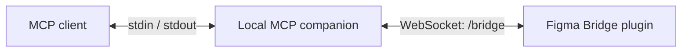
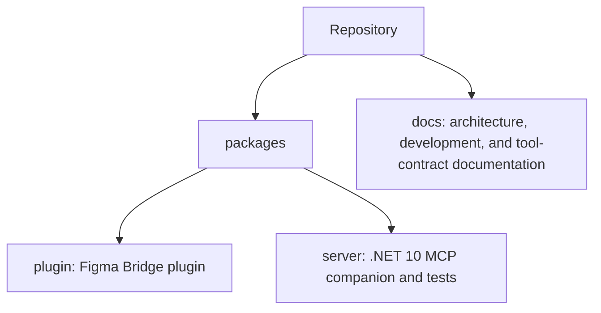

# Figma MCP

Figma MCP is a local companion for an open Figma document through the Figma Bridge plugin. The MCP
client starts a .NET process and communicates with it over STDIO, while the plugin connects to the
same process through a loopback WebSocket.



## Capabilities

- MCP over STDIO: the protocol uses `stdin` and `stdout`, while diagnostics go to `stderr`.
- A loopback-only MessagePack WebSocket bridge using `figma-mcp-bridge.v2`.
- Explicit `connection_id` values for document-specific tools.
- An in-memory connection registry, sequential RPC per connection, and bounded payloads.
- Local tools for reading and editing Figma Design documents.

The [documentation website](docs/) includes the [tool reference](docs/tools.md) and
[Plugin API coverage](docs/plugin-api-tool-coverage.md), which describe the contract, capabilities,
and limits.

## Requirements

- Figma Desktop.
- .NET 10 SDK when installing the companion as a global .NET tool.
- No .NET installation when using a self-contained Windows, Linux, or macOS release archive.
- Node.js and npm only when building the Figma plugin or running MCP Inspector from source.

## Quick start

1. Install the companion from NuGet.org:

   ```shell
   dotnet tool install --global FigmaMCP
   ```

2. Download `figma-mcp-plugin.<version>.zip` from the matching GitHub Release, extract it, and import its
   `manifest.json` in Figma Desktop as a development plugin. Open the plugin in the desired document.
   Keep the Bridge port at `3846`, unless you configure a different port for the server with
   `--port <1-65535>` or the server reports a fallback port on `stderr` at startup.

3. Configure the MCP client to start `figma-mcp-server` over STDIO:

   ```json
   {
     "mcpServers": {
       "figma": {
         "command": "figma-mcp-server"
       }
     }
   }
   ```

After the plugin connects, call `list_figma_connections` and pass the returned `connection_id` to
document-specific tools.

## Self-contained companion

Each GitHub Release also contains self-contained archives for Windows x64, Linux x64, and Apple
Silicon macOS. These builds do not require .NET to be installed:

- `figma-mcp-server-win-x64.<version>.zip`
- `figma-mcp-server-linux-x64.<version>.zip`
- `figma-mcp-server-osx-arm64.<version>.zip`

To build one locally, select its runtime explicitly:

```powershell
./build.ps1 --target :server:publish --configuration Release --runtime win-x64
```

The generated files are in `artifacts/server/<runtime>`. Configure `FigmaMCP.exe` on Windows or
`FigmaMCP` on Linux/macOS as the MCP server command. Add `--port <1-65535>` to select the local Bridge
port when the default `3846` is unavailable. Do not redirect its `stdout`: it is reserved for MCP
protocol traffic.

## Build from source

The repository pins the .NET SDK in [global.json](global.json). Build the companion, plugin, and
documentation through the root build:

```powershell
./build.ps1 --configuration Release
```

Start MCP Inspector against the local companion with:

```powershell
./build.ps1 --target :server:inspector --configuration Debug
```

## Repository layout



## Documentation

- [Documentation website](docs/)
- [Architecture](docs/architecture.md)
- [Development and validation](docs/development.md)
- [Normative specification](.agents/SPEC.md)
- [Contributing](CONTRIBUTING.md)
- [Security](.github/SECURITY.md)

## Validation status

The server and synthetic bridge tests run locally. The full scenario requires a manual Figma Desktop
check: import the development plugin, connect the bridge, and run a tool against a real document.

This project is not affiliated with Figma and is distributed under the [MIT License](LICENSE).
