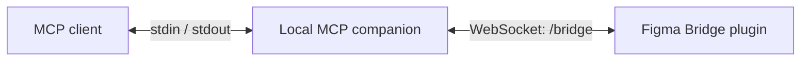
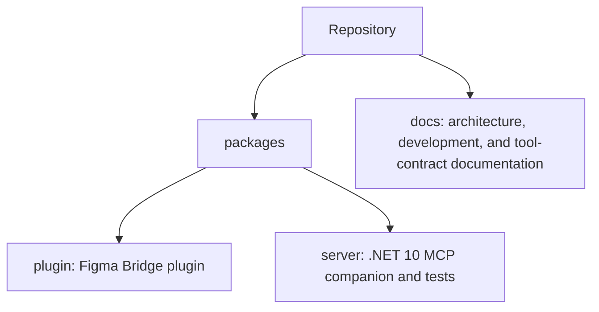

# Figma MCP

Figma MCP is a local companion for an open Figma document through the Figma Bridge plugin. The MCP
client starts a .NET process and communicates with it over STDIO, while the plugin connects to the
same process through a loopback WebSocket.



## Capabilities

- MCP over STDIO: the protocol uses `stdin` and `stdout`, while diagnostics go to `stderr`.
- A loopback-only MessagePack WebSocket bridge using `figma-mcp-bridge.v2`.
- Explicit `connection_id` values for document-specific tools.
- An in-memory connection registry, sequential RPC per connection, and bounded payloads.
- Local tools for reading and editing Figma Design documents.

The [documentation website](docs/) includes the [tool reference](docs/tools.md) and
[Plugin API coverage](docs/plugin-api-tool-coverage.md), which describe the contract, capabilities,
and limits.

## Requirements

- Windows x64.
- .NET SDK 10, pinned in [global.json](global.json).
- Node.js and npm to build the Figma plugin and run MCP Inspector.
- Figma Desktop for manual validation in a real document.

## Quick start

1. Build the companion and Bridge plugin through the root build:

   ```powershell
   ./build.ps1 --configuration Release
   ```

2. In Figma Desktop, import `packages/plugin/dist/manifest.json` as a development plugin and open it
   in the desired document. Keep the Bridge port at `3846`, unless you configure a different port for
   the server with `--port <1-65535>` or the server reports a fallback port on `stderr` at startup.

3. Start Inspector to verify an MCP session. The target builds the server and passes it to Inspector
   as a STDIO process:

   ```powershell
   ./build.ps1 --target :server:inspector --configuration Debug
   ```

After the plugin connects, call `list_figma_connections` and pass the returned `connection_id` to
document-specific tools.

## Connect an MCP client

To publish a standalone Windows binary:

```powershell
./build.ps1 --target :server:publish --configuration Release
```

The generated files are in `artifacts/server/win-x64`. Configure `figma-mcp-server.exe` as the MCP server command in the client. Add
`--port <1-65535>` to select the local Bridge port when the default `3846` is unavailable. Do not
redirect its `stdout`: it is reserved for MCP protocol traffic.

## Repository layout



## Documentation

- [Documentation website](docs/)
- [Architecture](docs/architecture.md)
- [Development and validation](docs/development.md)
- [Normative specification](.agents/SPEC.md)
- [Contributing](CONTRIBUTING.md)
- [Security](.github/SECURITY.md)

## Validation status

The server and synthetic bridge tests run locally. The full scenario requires a manual Figma Desktop
check: import the development plugin, connect the bridge, and run a tool against a real document.

This project is not affiliated with Figma and is distributed under the [MIT License](LICENSE).
