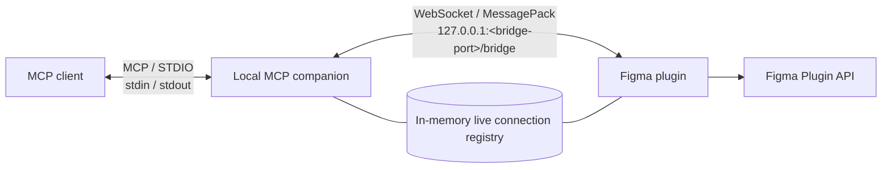

# Architecture

## Purpose

The companion provides MCP access to Figma documents where the user has opened the Bridge plugin.
All runtime state is local to the user's machine and held in memory.

## Components and transports

The process has two transport roles:

- STDIO serves MCP. `stdout` is reserved for MCP protocol messages, while logs and diagnostics go to
  `stderr`.
- The loopback WebSocket `/bridge` serves the Bridge plugin. It accepts only `127.0.0.1:<port>` and
  `localhost:<port>` Host values.

## Connection lifecycle

1. The MCP client starts the local companion and establishes a STDIO session.
2. The plugin UI opens `ws://127.0.0.1:<bridge-port>/bridge` with the `figma-mcp-bridge.v2` subprotocol. The bridge port defaults to `3846` and can be set with the MCP server's `--port <1-65535>` argument.
3. The plugin sends `hello` with a random `connection_id` and document context.
4. The companion validates the message, stores the connection in the in-memory registry, and returns
   `hello_ack`.
5. The MCP client calls `list_figma_connections`, selects an active `connection_id`, and passes it to
   every document-specific tool.
6. The companion serializes calls into bridge requests and matches responses by `request_id`.
7. On disconnect, the connection is removed and pending requests complete with a controlled error.

A `connection_id` identifies a plugin invocation rather than a persistent Figma file. A connection
replacement uses compare-and-swap so a stale socket cannot remove the active replacement.

## Bridge protocol

The bridge wire format has these properties:

- One MessagePack map per binary WebSocket frame.
- The `figma-mcp-bridge.v2` subprotocol.
- Envelope fields: `type`, `protocol_version`, `sent_at`, and, when required, `connection_id`,
  `request_id`, `method`, `payload`, and `error`.
- Lowercase canonical UUIDs and UTC ISO-8601 timestamps.
- A 16 MiB bridge-message limit and a 12 MiB limit for base64 binary data.
- An operation allowlist and structured payloads, with no JavaScript execution or arbitrary property
  reflection.

Requests for one connection run sequentially and have a 30-second deadline. Mutations can use
`dry_run` and `idempotency_key`; the plugin retains invocation-local results so a repeated key does
not repeat the write.

## State and security boundaries

The connection registry and pending requests live only in companion memory. Restarting the process
requires the plugin to reconnect.

The bridge is loopback-only. It validates Host, Origin, and WebSocket subprotocol values before
accepting a connection. The plugin stores only the local bridge port and does not send an access token
in the WebSocket URL or bridge envelopes.
