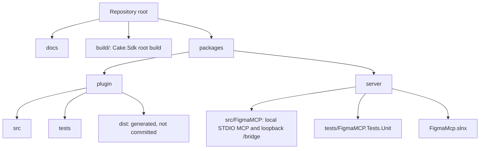

# Development

## Repository layout

The repository contains the local companion, the Figma Bridge plugin, their tests, and supporting
documentation:



## Root build

The root `build/build.cs` is a Cake.Sdk build. Use `build.ps1` on Windows and `bash build.sh` on Linux or macOS; both forward their arguments to Cake and run from the repository root.
Use it instead of changing into package directories or reproducing CI commands:

Named targets use a leading colon. Select a scenario with `--target`, for example `:server:build` or
`:package:release`. Without `--target`, the default `:build` target builds the documentation website
and both runtime components.

```powershell
./build.ps1
./build.ps1 --target :docs:build
./build.ps1 --target :docs:typecheck
./build.ps1 --target :server:build --configuration Release
./build.ps1 --target :plugin:test
./build.ps1 --target :package:release --configuration Release
./build.ps1 --target :server:inspector --configuration Debug
```

On Linux and macOS, replace `./build.ps1` with `bash ./build.sh`.

The docs targets install the locked npm dependencies from `docs/package-lock.json`. `:docs:typecheck`
validates the VitePress configuration, and `:docs:build` type-checks and generates the static site in
`docs/.vitepress/dist/`.

Pushes to `master` run `.github/workflows/docs.yml`. The workflow builds the website through
`:docs:build`, uploads `docs/.vitepress/dist/` as the GitHub Pages artifact, and deploys it to the
`github-pages` environment. It supplies the repository-specific Pages base path through `DOCS_BASE`;
local builds default to `/`.

Use `--dryrun` to display a target's dependency graph without executing it. Generated packages and
archives are written beneath `artifacts/`.

GitHub Actions delegates release scenarios to Cake as well. `:release:prepare` validates a
`--release-tag`, creates the three release assets, and creates or updates the draft GitHub release.
`:release:publish:nuget` and `:release:publish:github-packages` validate the tag, download the
published release package, and publish it to the corresponding registry. These targets require the
GitHub Actions token environment variables and should normally be run only by their workflows.

## Companion

The server uses .NET 10 and central package management. The root build exposes its usual targets:

```powershell
./build.ps1 --target :server:format
./build.ps1 --target :server:build --configuration Release
./build.ps1 --target :server:test --configuration Release
./build.ps1 --target :server:publish --configuration Release --runtime win-x64
./build.ps1 --target :server:publish --configuration Release --runtime linux-x64
./build.ps1 --target :server:publish --configuration Release --runtime osx-arm64
./build.ps1 --target :server:publish-tests --configuration Release --runtime linux-x64
```

`:server:publish` selects the publish profile named after its runtime and writes the self-contained
output under `artifacts/server/<runtime>/`. CI cross-publishes the Windows x64, Linux x64, and macOS
ARM64 profiles in parallel on Ubuntu and uploads one artifact per runtime.

`:server:publish-tests` creates the self-contained Microsoft.Testing.Platform executable used by CI
under `artifacts/server-tests/<runtime>/`. The executable runs without a .NET installation or source
checkout. Its two portable PDB files remain beside it so the standalone Linux test run can produce
line coverage. CI builds and runs the test artifact on Ubuntu, restores the executable permission
removed by artifact transfer, and configures the coverage collector to resolve those external symbols
and retain assemblies whose source checkout is intentionally absent. Local test runs continue to use
`:server:test` and `dotnet test`.

During development, start the STDIO server through an MCP client or a local STDIO harness. Do not
write diagnostics to `stdout`: that stream belongs to the MCP protocol. The local bridge listens on
`127.0.0.1:3846` for the plugin by default. If no `--port` is supplied and that port is occupied, the
server detects this before Kestrel starts, then tries subsequent ports through `65535` and writes the
selected fallback to `stderr`. Pass
`--port <1-65535>` in the MCP server command to use a fixed bridge port; explicit ports are never
changed.

## Bridge plugin

The plugin uses the MessagePack bridge protocol and stores only the local bridge port. Its root-build targets install its locked npm dependencies as needed:

```powershell
./build.ps1 --target :plugin:format
./build.ps1 --target :plugin:lint
./build.ps1 --target :plugin:test
./build.ps1 --target :plugin:build
```

Import `packages/plugin/dist/manifest.json` as a development plugin in Figma Desktop. Keep the
bridge port at its default, `3846`, unless the MCP server was started with a different `--port` value
or reported a fallback port on `stderr`; the plugin derives `ws://127.0.0.1:<bridge-port>/bridge`
without query parameters.

## Local scenario validation

Validate this sequence in Figma Desktop:

1. The MCP client starts the companion as a STDIO process.
2. The plugin connects to `ws://127.0.0.1:<bridge-port>/bridge` and receives `hello_ack`.
3. `list_figma_connections` returns the plugin connection.
4. A tool with the selected `connection_id` receives a response from Figma through the bridge.
5. Closing the plugin completes a pending request with an error and removes the connection from the list.
