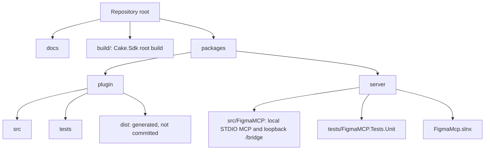
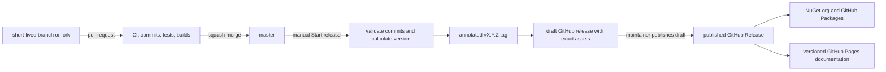

# Development

## Repository layout

The repository contains the local companion, the Figma Bridge plugin, their tests, and supporting
documentation:



## Root build

The root `build/build.cs` is a Cake.Sdk build. Use `build.ps1` on Windows and `bash build.sh` on Linux or macOS; both forward their arguments to Cake and run from the repository root.
Use it instead of changing into package directories or reproducing CI commands:

Named targets use a leading colon. Select a scenario with `--target`, for example `:server:build` or
`:package:release`. Without `--target`, the default `:build` target builds the documentation website
and both runtime components.

```powershell
./build.ps1
./build.ps1 --target :docs:build
./build.ps1 --target :docs:typecheck
./build.ps1 --target :server:build --configuration Release
./build.ps1 --target :plugin:test
./build.ps1 --target :package:release --configuration Release
./build.ps1 --target :server:inspector --configuration Debug
```

On Linux and macOS, replace `./build.ps1` with `bash ./build.sh`.

The docs targets install the locked npm dependencies from `docs/package-lock.json`. `:docs:typecheck`
validates the VitePress configuration, and `:docs:build` type-checks and generates the static site in
`docs/.vitepress/dist/`.

Publishing a GitHub Release runs `.github/workflows/docs.yml`. The workflow checks out the exact
release tag, builds the website through `:docs:build`, uploads `docs/.vitepress/dist/` as the GitHub
Pages artifact, and deploys it to the `github-pages` environment. It supplies the repository-specific
Pages base path through `DOCS_BASE` and the published tag through `DOCS_VERSION`. The version appears
in the site navigation and footer. Local builds default to `/` and identify themselves as
`development` documentation.

Use `--dryrun` to display a target's dependency graph without executing it. Generated packages and
archives are written beneath `artifacts/`.

## Versioning and releases

The repository follows trunk-based development. `master` is the only long-lived branch; work from a
short-lived branch with any useful name and squash the pull request into one Conventional Commit.
Pull requests from forks follow the same flow. Pull request titles are not versioning inputs.



GitVersion calculates one product version from the Git history and `GitVersion.yml`. Cake passes it
to .NET assembly/package metadata and to the plugin's Rolldown build, so local and CI artifacts use
the same versioning rules. The source manifests store the stable baseline `1.0.0`; ordinary branch
builds add a Git-derived prerelease label and informational SHA. Version changes are determined by
commits since the latest release tag:

| Commit                                                                        | Version change |
| ----------------------------------------------------------------------------- | -------------- |
| `feat:`                                                                       | minor          |
| `fix:` or `perf:`                                                             | patch          |
| Any conventional type with `!`, or a `BREAKING CHANGE` footer                 | major          |
| `build:`, `chore:`, `ci:`, `docs:`, `refactor:`, `revert:`, `style:`, `test:` | none           |

Install the local `commit-msg` hook with `:commits:hook:install`. The hook and the CI
`:commits:check` target both use the repository-pinned commitlint configuration.

GitHub Actions delegates release scenarios to Cake. Run the **Start release** workflow manually on
`master`; `:release:prepare` verifies that the checkout is the exact clean `origin/master` commit,
validates its release commit range, computes the next version, creates and pushes the annotated tag,
builds the NuGet package and symbols, three self-contained server archives, and the plugin archive,
then creates or updates a draft GitHub release. Every server and plugin archive includes the product
version in its file name. Publishing that draft
starts **Finish release**. Its `:release:publish:nuget` and `:release:publish:github-packages` targets
download the exact packages attached to the published release and send them to the corresponding
registry. NuGet.org authentication uses Trusted Publishing with a short-lived OIDC credential from
the protected `nuget-org` environment; no long-lived NuGet API key is stored. Release
targets require GitHub Actions credentials and should normally run only in their workflows.

## Companion

The server uses .NET 10 and central package management. The root build exposes its usual targets:

```powershell
./build.ps1 --target :server:format
./build.ps1 --target :server:build --configuration Release
./build.ps1 --target :server:test --configuration Release
./build.ps1 --target :server:publish --configuration Release --runtime win-x64
./build.ps1 --target :server:publish --configuration Release --runtime linux-x64
./build.ps1 --target :server:publish --configuration Release --runtime osx-arm64
./build.ps1 --target :server:publish-tests --configuration Release --runtime linux-x64
```

`:server:publish` selects the publish profile named after its runtime and writes the self-contained
output under `artifacts/server/<runtime>/`. CI cross-publishes the Windows x64, Linux x64, and macOS
ARM64 profiles in parallel on Ubuntu and uploads one versioned artifact per runtime. A separate CI
job builds the versioned NuGet package and symbol package and uploads them together as one artifact.

`:server:publish-tests` creates the self-contained Microsoft.Testing.Platform executable used by CI
under `artifacts/server-tests/<runtime>/`. The executable runs without a .NET installation or source
checkout. Its two portable PDB files remain beside it so the standalone Linux test run can produce
line coverage. CI builds and runs the test artifact on Ubuntu, restores the executable permission
removed by artifact transfer, and configures the coverage collector to resolve those external symbols
and retain assemblies whose source checkout is intentionally absent. Local test runs continue to use
`:server:test` and `dotnet test`.

During development, start the STDIO server through an MCP client or a local STDIO harness. Do not
write diagnostics to `stdout`: that stream belongs to the MCP protocol. The local bridge listens on
`127.0.0.1:3846` for the plugin by default. If no `--port` is supplied and that port is occupied, the
server detects this before Kestrel starts, then tries subsequent ports through `65535` and writes the
selected fallback to `stderr`. Pass
`--port <1-65535>` in the MCP server command to use a fixed bridge port; explicit ports are never
changed.

## Bridge plugin

The plugin uses the MessagePack bridge protocol and stores only the local bridge port. Its root-build targets install its locked npm dependencies as needed:

```powershell
./build.ps1 --target :plugin:format
./build.ps1 --target :plugin:lint
./build.ps1 --target :plugin:test
./build.ps1 --target :plugin:build
```

Import `packages/plugin/dist/manifest.json` as a development plugin in Figma Desktop. Keep the
bundled `icon.png` with the distribution; it is the 128 x 128 Community icon to upload in Figma's
publishing flow (the plugin manifest does not define Community listing artwork). Keep the
bridge port at its default, `3846`, unless the MCP server was started with a different `--port` value
or reported a fallback port on `stderr`; the plugin derives `ws://127.0.0.1:<bridge-port>/bridge`
without query parameters.

## Local scenario validation

Validate this sequence in Figma Desktop:

1. The MCP client starts the companion as a STDIO process.
2. The plugin connects to `ws://127.0.0.1:<bridge-port>/bridge` and receives `hello_ack`.
3. `list_figma_connections` returns the plugin connection.
4. A tool with the selected `connection_id` receives a response from Figma through the bridge.
5. Closing the plugin completes a pending request with an error and removes the connection from the list.
