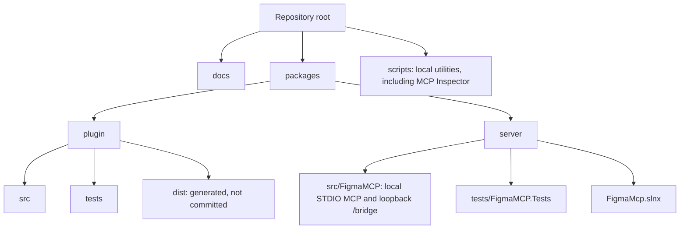

# Development

## Repository layout

The repository contains the local companion, the Figma Bridge plugin, their tests, and supporting
documentation:



## Companion

The server uses .NET 10 and central package management. Run these commands from the repository root:

```powershell
cd packages/server
dotnet restore FigmaMcp.slnx
dotnet format FigmaMcp.slnx --verify-no-changes --no-restore
dotnet build FigmaMcp.slnx --configuration Release
dotnet test --solution FigmaMcp.slnx --configuration Release
```

During development, start the STDIO server through an MCP client or a local STDIO harness. Do not
write diagnostics to `stdout`: that stream belongs to the MCP protocol. The local bridge listens on
`127.0.0.1:3846` for the plugin by default. If no `--port` is supplied and that port is occupied, the
server detects this before Kestrel starts, then tries subsequent ports through `65535` and writes the
selected fallback to `stderr`. Pass
`--port <1-65535>` in the MCP server command to use a fixed bridge port; explicit ports are never
changed.

## Bridge plugin

The plugin uses the MessagePack bridge protocol and stores only the local bridge port:

```powershell
cd packages/plugin
npm install
npm run format:check
npm run lint
npm run typecheck
npm test
npm run build
```

Import `packages/plugin/dist/manifest.json` as a development plugin in Figma Desktop. Keep the
bridge port at its default, `3846`, unless the MCP server was started with a different `--port` value
or reported a fallback port on `stderr`; the plugin derives `ws://127.0.0.1:<bridge-port>/bridge`
without query parameters.

## Local scenario validation

Validate this sequence in Figma Desktop:

1. The MCP client starts the companion as a STDIO process.
2. The plugin connects to `ws://127.0.0.1:<bridge-port>/bridge` and receives `hello_ack`.
3. `list_figma_connections` returns the plugin connection.
4. A tool with the selected `connection_id` receives a response from Figma through the bridge.
5. Closing the plugin completes a pending request with an error and removes the connection from the list.
