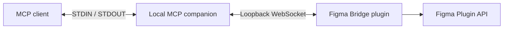

# Figma MCP Overview

Figma MCP is a local companion for Figma documents with the Figma Bridge plugin open. An MCP client
starts the .NET process and exchanges protocol messages with it over STDIO.

## System overview



The companion has two transport roles:

- STDIO serves MCP. Protocol messages use `stdin` and `stdout`; diagnostics use `stderr`.
- The loopback WebSocket endpoint at `/bridge` serves the Figma Bridge plugin.

The server, plugin, and bridge use explicit typed contracts. Document-specific MCP tools receive a
live `connection_id`, and bridge operations use bounded payloads, a 30-second deadline, and
idempotent mutation keys where applicable.

## Starting the companion

The MCP client starts the executable as a child process. A client configuration can look like this:

```json
{
  "mcpServers": {
    "figma": {
      "command": "C:\\path\\to\\figma-mcp-server.exe"
    }
  }
}
```

The process listens on `127.0.0.1:3846/bridge` for the plugin. The bridge is loopback-only and must
not bind to an external interface.

## Documentation map

- [Architecture](ARCHITECTURE.md) explains transports, lifecycle, state, and security boundaries.
- [Development](DEVELOPMENT.md) describes the repository layout, build commands, and local checks.
- [Tool reference](TOOLS.md) defines the MCP tool contract.
- [Plugin API coverage](PLUGIN_API_TOOL_COVERAGE.md) records supported and deferred Figma API areas.
