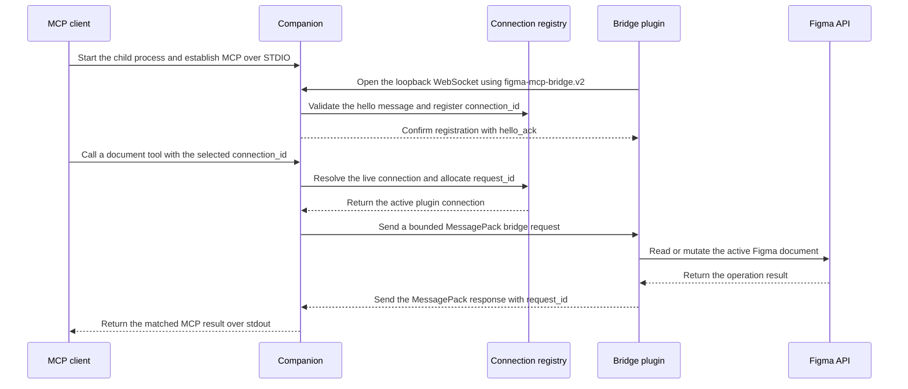

## Overview

Figma MCP is a local companion for Figma documents with the Figma Bridge plugin open. An MCP client
starts the .NET process and exchanges protocol messages with it over STDIO.



The companion has two transport roles:

- STDIO serves MCP. Protocol messages use `stdin` and `stdout`; diagnostics use `stderr`.
- The loopback WebSocket endpoint at `/bridge` serves the Figma Bridge plugin.

The server, plugin, and bridge use explicit typed contracts. Document-specific MCP tools receive a
live `connection_id`, and bridge operations use bounded payloads, a 30-second deadline, and
idempotent mutation keys where applicable.

## Starting the companion

The MCP client starts the executable as a child process. A client configuration can look like this:

```json
{
  "mcpServers": {
    "figma": {
      "command": "C:\\path\\to\\FigmaMCP.exe"
    }
  }
}
```

The process listens on `127.0.0.1:3846/bridge` for the plugin by default. If no `--port` is supplied
and `3846` is occupied, it detects that before Kestrel starts, tries subsequent ports through `65535`,
and reports the selected fallback on `stderr`. Pass `--port <1-65535>` to use one specific bridge
port; an explicit port is never changed. Set the Bridge plugin to the port the server selected. The
bridge is loopback-only and must not bind to an external interface.

## Documentation map

- [Architecture](/ARCHITECTURE) explains transports, lifecycle, state, and security boundaries.
- [Development](/DEVELOPMENT) describes the repository layout, build commands, and local checks.
- [Tool reference](/TOOLS) defines the MCP tool contract.
- [Plugin API coverage](/plugin-api-tool-coverage) records supported and deferred Figma API areas.
