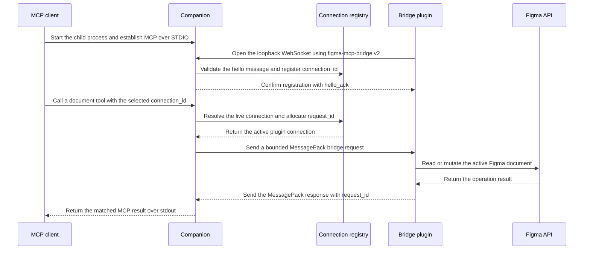

{.brand-banner}

## Overview

Figma MCP is a local companion for Figma documents with the Figma Bridge plugin open. An MCP client
starts the .NET process and exchanges protocol messages with it over STDIO.

```mermaid
sequenceDiagram
    participant Client as MCP client
    participant Companion as Companion
    participant Registry as Connection registry
    participant Plugin as Bridge plugin
    participant Figma as Figma API

    Client->>Companion: Start the child process and establish MCP over STDIO
    Plugin->>Companion: Open the loopback WebSocket using figma-mcp-bridge.v2
    Companion->>Registry: Validate the hello message and register connection_id
    Companion-->>Plugin: Confirm registration with hello_ack
    Client->>Companion: Call a document tool with the selected connection_id
    Companion->>Registry: Resolve the live connection and allocate request_id
    Registry-->>Companion: Return the active plugin connection
    Companion->>Plugin: Send a bounded MessagePack bridge request
    Plugin->>Figma: Read or mutate the active Figma document
    Figma-->>Plugin: Return the operation result
    Plugin-->>Companion: Send the MessagePack response with request_id
    Companion-->>Client: Return the matched MCP result over stdout
```

The companion has two transport roles:

- STDIO serves MCP. Protocol messages use `stdin` and `stdout`; diagnostics use `stderr`.
- The loopback WebSocket endpoint at `/bridge` serves the Figma Bridge plugin.

The server, plugin, and bridge use explicit typed contracts. Document-specific MCP tools receive a
live `connection_id`, and bridge operations use bounded payloads, a 30-second deadline, and
idempotent mutation keys where applicable.

## Install and connect

Install the companion and Bridge plugin, then connect your MCP client using the
[installation guide](/INSTALLATION). The client starts the companion over STDIO, and the plugin
connects to its local Bridge endpoint.

## Documentation map

- [Architecture](/ARCHITECTURE) explains transports, lifecycle, state, and security boundaries.
- [Installation](/INSTALLATION) walks through installing the companion and connecting the plugin and MCP client.
- [Development](/DEVELOPMENT) describes the repository layout, build commands, and local checks.
- [Tool reference](/TOOLS) defines the MCP tool contract.
- [Plugin API coverage](/plugin-api-tool-coverage) records supported and deferred Figma API areas.
