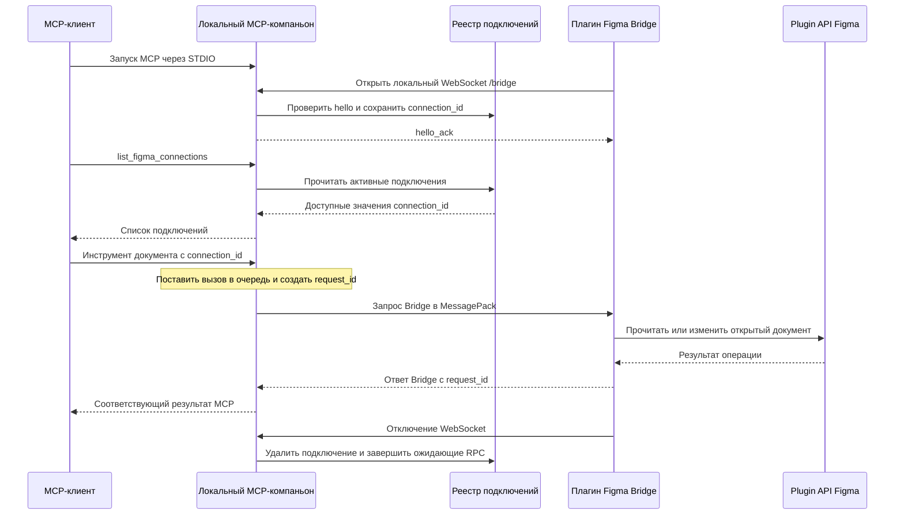

# Архитектура

## Назначение

Компаньон предоставляет MCP-доступ к документам Figma, в которых пользователь открыл плагин Bridge. Всё состояние во время работы находится в памяти на компьютере пользователя.

## Компоненты и транспорт

Процесс работает с двумя транспортами:

- STDIO обслуживает MCP. `stdout` предназначен только для сообщений протокола MCP, а журналы и диагностика выводятся в `stderr`.
- Локальный WebSocket `/bridge` обслуживает плагин Bridge. Он принимает только значения Host `127.0.0.1:<port>` и `localhost:<port>`.

## Жизненный цикл подключения

1. MCP-клиент запускает локальный компаньон и устанавливает сессию STDIO.
2. Интерфейс плагина открывает `ws://127.0.0.1:<bridge-port>/bridge` с подпротоколом `figma-mcp-bridge.v2`. По умолчанию используется порт `3846`; его можно изменить аргументом MCP-сервера `--port <1-65535>`.
3. Плагин отправляет `hello` со случайным `connection_id` и контекстом документа.
4. Компаньон проверяет сообщение, сохраняет подключение во внутриизменяемом реестре в памяти и отвечает `hello_ack`.
5. MCP-клиент вызывает `list_figma_connections`, выбирает активный `connection_id` и передаёт его каждому инструменту документа.
6. Компаньон последовательно отправляет запросы bridge и сопоставляет ответы по `request_id`.
7. При отключении подключение удаляется, а ожидающие запросы завершаются контролируемой ошибкой.

`connection_id` обозначает экземпляр запущенного плагина, а не постоянный файл Figma. При замене подключения используется compare-and-swap, поэтому устаревший сокет не может удалить новое активное подключение.

## Протокол Bridge

- Один map MessagePack на бинарный WebSocket-кадр.
- Подпротокол `figma-mcp-bridge.v2`.
- Поля конверта: `type`, `protocol_version`, `sent_at`, а при необходимости — `connection_id`, `request_id`, `method`, `payload` и `error`.
- Канонические UUID в нижнем регистре и временные метки UTC в формате ISO 8601.
- Ограничение сообщения Bridge — 16 МиБ, данных base64 — 12 МиБ.
- Список разрешённых операций и структурированные данные; выполнение JavaScript и произвольное отражение свойств запрещены.

Запросы для одного подключения выполняются последовательно с тайм-аутом 30 секунд. Изменения могут использовать `dry_run` и `idempotency_key`; плагин хранит результаты в рамках текущего запуска, чтобы повторный ключ не выполнял запись ещё раз.

## Состояние и границы безопасности

Реестр подключений и ожидающие запросы находятся только в памяти компаньона. После перезапуска процесса плагин должен подключиться повторно.

Bridge доступен только через loopback-интерфейс. Перед принятием подключения проверяются значения Host, Origin и подпротокол WebSocket. Плагин хранит только локальный порт Bridge и не передаёт токен доступа в URL WebSocket или конвертах Bridge.
