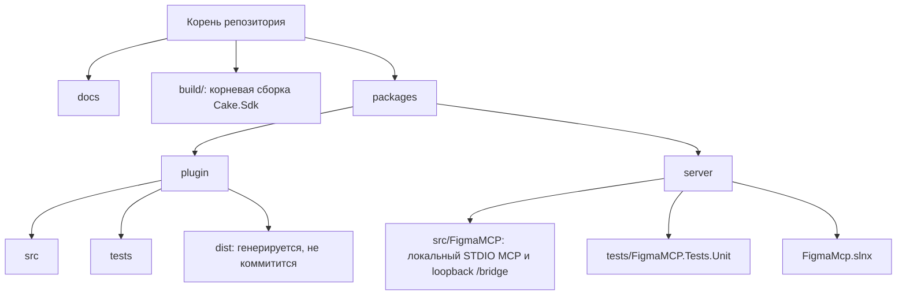
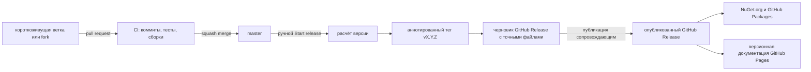

# Разработка

## Структура репозитория

В репозитории находятся локальный компаньон, плагин Figma Bridge, их тесты и документация:



## Корневая сборка

Корневой `build/build.cs` — сборка Cake.Sdk. В Windows используйте `build.ps1`, в Linux и macOS — `bash build.sh`. Оба скрипта передают аргументы Cake и запускаются из корня репозитория. Используйте их вместо перехода в каталоги пакетов и ручного воспроизведения команд CI.

Имена целей начинаются с двоеточия. Выберите сценарий с `--target`, например `:server:build` или `:package:release`. Если `--target` не указан, цель `:build` по умолчанию собирает сайт документации и оба исполняемых компонента.

```powershell
./build.ps1
./build.ps1 --target :docs:build
./build.ps1 --target :docs:typecheck
./build.ps1 --target :server:build --configuration Release
./build.ps1 --target :plugin:test
./build.ps1 --target :package:release --configuration Release
./build.ps1 --target :server:inspector --configuration Debug
```

В Linux и macOS вместо `./build.ps1` используйте `bash ./build.sh`.

Цели документации устанавливают npm-зависимости по `docs/package-lock.json`. `:docs:typecheck` проверяет конфигурацию VitePress, а `:docs:build` выполняет проверку типов и собирает статический сайт в `docs/.vitepress/dist/`.

При публикации GitHub Release запускается `.github/workflows/docs.yml`. Workflow получает точный тег выпуска, запрашивает последний опубликованный тег через GitHub API, собирает сайт с помощью `:docs:build`, загружает `docs/.vitepress/dist/` как артефакт GitHub Pages и публикует его в окружение `github-pages`. Для этого используются `DOCS_BASE` с базовым путём Pages репозитория и `DOCS_VERSION` с тегом API. Версия показывается в навигации и нижнем колонтитуле и ведёт на выпуск. Локальная сборка по умолчанию использует `/` и помечает документацию как `development`.

Флаг `--dryrun` выводит граф зависимостей цели без её выполнения. Сгенерированные пакеты и архивы сохраняются в `artifacts/`.

## Версии и выпуски

Репозиторий использует trunk-based development. Единственная долгоживущая ветка — `master`; работайте в короткоживущей ветке с подходящим именем и объединяйте pull request одним Conventional Commit через squash. Pull request из fork проходит тот же процесс. Заголовки pull request не влияют на версию.



GitVersion рассчитывает версию продукта на основе истории Git и `GitVersion.yml`. Cake передаёт её в метаданные сборок и пакетов .NET, а также в сборку плагина Rolldown, поэтому локальные и CI-артефакты используют одинаковые правила версионирования. В исходных манифестах хранится стабильная базовая версия `1.0.0`; обычные сборки веток добавляют полученную из Git метку предварительной версии и информационный SHA. Изменение версии зависит от коммитов после последнего тега выпуска:

| Коммит                                                                        | Изменение версии |
| ----------------------------------------------------------------------------- | ---------------- |
| `feat:`                                                                       | minor            |
| `fix:` или `perf:`                                                            | patch            |
| Любой Conventional Commit с `!` или строкой `BREAKING CHANGE`                 | major            |
| `build:`, `chore:`, `ci:`, `docs:`, `refactor:`, `revert:`, `style:`, `test:` | без изменения    |

Установите локальный hook `commit-msg` целью `:commits:hook:install`. Hook и цель CI `:commits:check` используют закреплённую в репозитории конфигурацию commitlint.

CI запускает commitlint только для pull request; push в `master` и релизные workflow пропускают эту проверку. Перед squash merge проверьте итоговое сообщение коммита, даже если коммиты PR уже прошли CI.

GitHub Actions передаёт сценарии выпуска Cake. Вручную запустите workflow **Start release** на ветке `master`: цель `:release:prepare` проверяет, что checkout соответствует точному чистому коммиту `origin/master`, вычисляет следующую версию, создаёт и отправляет аннотированный тег, собирает NuGet-пакет с символами, три автономных архива сервера и архив плагина, затем создаёт или обновляет черновик GitHub Release. Версия включена в имена архивов сервера и плагина. Публикация черновика запускает **Finish release**. Цели `:release:publish:nuget` и `:release:publish:github-packages` загружают точные пакеты из опубликованного выпуска и отправляют их в соответствующие реестры. Для NuGet.org используется Trusted Publishing с краткоживущими OIDC-учётными данными защищённого окружения `nuget-org`; постоянный ключ NuGet API не хранится. Целям выпуска нужны учётные данные GitHub Actions, поэтому обычно они запускаются только в workflow.

## Сервер-компаньон

Сервер использует .NET 10 и централизованное управление пакетами. Обычные цели корневой сборки:

```powershell
./build.ps1 --target :server:format
./build.ps1 --target :server:build --configuration Release
./build.ps1 --target :server:test --configuration Release
./build.ps1 --target :server:publish --configuration Release --runtime win-x64
./build.ps1 --target :server:publish --configuration Release --runtime linux-x64
./build.ps1 --target :server:publish --configuration Release --runtime osx-arm64
./build.ps1 --target :server:publish-tests --configuration Release --runtime linux-x64
```

`:server:publish` выбирает профиль публикации по runtime и помещает автономную сборку в `artifacts/server/<runtime>/`. CI параллельно публикует профили Windows x64, Linux x64 и macOS ARM64 в Ubuntu и загружает версионный артефакт для каждой платформы. Отдельная задача CI собирает версионный NuGet-пакет и пакет символов и загружает их вместе.

`:server:publish-tests` создаёт автономный исполняемый файл Microsoft.Testing.Platform для CI в `artifacts/server-tests/<runtime>/`. Он запускается без установки .NET и без checkout исходного кода. Два переносимых PDB-файла остаются рядом с ним, чтобы тестовый запуск Linux мог собирать покрытие строк. CI собирает и запускает этот артефакт в Ubuntu, восстанавливает право на выполнение после передачи артефакта и настраивает сборщик покрытия для поиска внешних символов без локального checkout. Локально используйте `:server:test` и `dotnet test`.

Во время разработки запускайте STDIO-сервер через MCP-клиент или локальный STDIO harness. Не выводите диагностику в `stdout`: этот поток предназначен протоколу MCP. По умолчанию локальный bridge слушает `127.0.0.1:3846`. Если порт занят и `--port` не задан, сервер проверяет это до запуска Kestrel, перебирает следующие порты до `65535` и сообщает выбранный порт в `stderr`. Для фиксированного порта укажите в команде MCP-сервера `--port <1-65535>`; явный порт не меняется.

## Плагин Bridge

Плагин использует протокол Bridge на основе MessagePack и хранит только локальный порт bridge. Цели сборки устанавливают закреплённые npm-зависимости при необходимости:

```powershell
./build.ps1 --target :plugin:format
./build.ps1 --target :plugin:lint
./build.ps1 --target :plugin:test
./build.ps1 --target :plugin:build
```

Импортируйте `packages/plugin/dist/manifest.json` как плагин для разработки в Figma Desktop. Не удаляйте включённый `icon.png`: это иконка Community размером 128 × 128 для загрузки в процессе публикации плагина в Figma (манифест плагина не задаёт изображение для страницы Community). Оставьте порт bridge равным `3846`, если MCP-сервер не запущен с другим значением `--port` или не сообщил запасной порт в `stderr`. Плагин формирует адрес `ws://127.0.0.1:<bridge-port>/bridge` без query-параметров.

## Проверка локального сценария

Проверьте этот сценарий в Figma Desktop:

1. MCP-клиент запускает компаньон как STDIO-процесс.
2. Плагин подключается к `ws://127.0.0.1:<bridge-port>/bridge` и получает `hello_ack`.
3. `list_figma_connections` возвращает подключение плагина.
4. Инструмент с выбранным `connection_id` получает ответ Figma через bridge.
5. При закрытии плагина ожидающий запрос завершается ошибкой, а подключение исчезает из списка.
