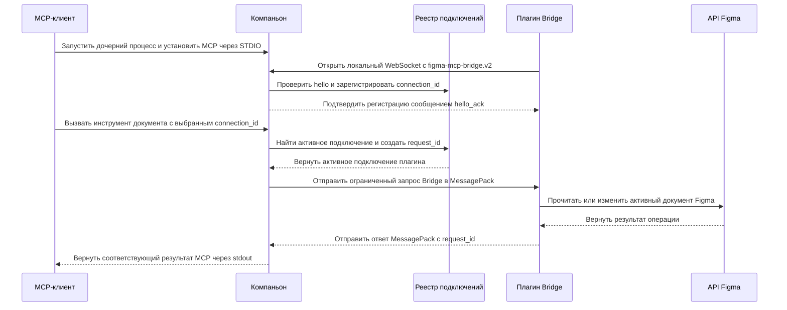

{.brand-banner}

## Обзор

Figma MCP — локальный компаньон для документов Figma, в которых открыт плагин Figma Bridge. MCP-клиент запускает процесс .NET и обменивается с ним протокольными сообщениями через STDIO.

Компаньон работает с двумя транспортами:

- STDIO обслуживает MCP. Протокольные сообщения передаются через `stdin` и `stdout`, диагностика — через `stderr`.
- Локальная конечная точка WebSocket `/bridge` обслуживает плагин Figma Bridge.

Сервер, плагин и bridge используют явные типизированные контракты. Инструменты для работы с документом получают действующий `connection_id`; операции bridge используют ограниченные данные, тайм-аут 30 секунд и ключи идемпотентности для изменений, где это применимо.

## Установка и подключение

Установите компаньон и плагин Bridge, затем настройте MCP-клиент по [руководству по установке](./INSTALLATION). Клиент запускает компаньон через STDIO, а плагин подключается к локальной конечной точке Bridge.

## Документация

- [Архитектура](./ARCHITECTURE): транспорт, жизненный цикл, состояние и границы безопасности.
- [Установка](./INSTALLATION): установка компаньона, подключение плагина и настройка MCP-клиента.
- [Разработка](./DEVELOPMENT): структура репозитория, команды сборки и локальные проверки.
- [Справочник инструментов](./TOOLS): контракт MCP-инструментов.
- [Покрытие Plugin API](./plugin-api-tool-coverage): поддерживаемые и отложенные области API Figma.
